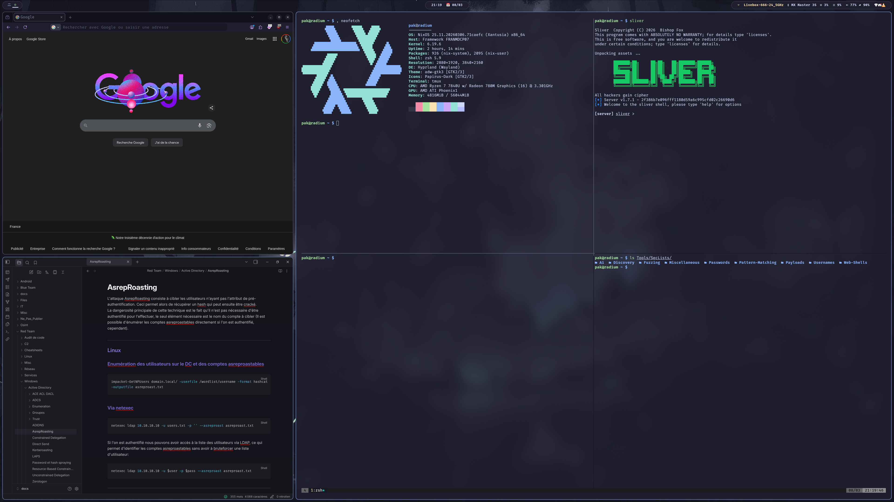

# 🧪 Radium - NixOS Pentest Environment

Bienvenue dans mon dépôt de configuration NixOS ! Ce système, nommé **Radium**, est conçu sur mesure pour être un environnement complet de cybersécurité et de développement, tout en offrant une expérience bureautique moderne et esthétique.

Cette configuration utilise les **Flakes**, **Home Manager**, et **Stylix** pour garantir une reproductibilité parfaite et une gestion de thème centralisée.



## 🏗️ Architecture du Projet

La configuration est structurée de manière modulaire pour séparer les éléments du système de ceux de l'utilisateur.

```text
/etc/nixos/
├── flake.nix                  # Point d'entrée principal (déclare les inputs et l'hôte 'radium')
├── configuration.nix          # Configuration globale du système NixOS (boot, réseau, services)
├── hardware-configuration.nix # Configuration matérielle générée automatiquement
├── home.nix                   # Point d'entrée de Home Manager pour l'utilisateur 'pak'
├── wallpaper.jpg              # Fond d'écran utilisé par Stylix
└── modules/                   # Modules spécifiques séparés par domaine
    ├── home/                  # Modules gérés par Home Manager (User-space)
    │   ├── cyber.nix          # Outils de pentest, OSINT et reverse engineering
    │   ├── hypr.nix           # Environnement de bureau Hyprland, Waybar et Rofi
    │   ├── kitty.nix          # Émulateur de terminal
    │   ├── nvim.nix           # Éditeur de texte Neovim
    │   ├── tmux.nix           # Multiplexeur de terminal
    │   └── zsh.nix            # Configuration du shell Zsh, alias et prompt
    └── nixos/                 # Modules gérés par NixOS (System-space)
        ├── sddm.nix           # Gestionnaire de connexion
        └── stylix.nix         # Gestion centralisée des thèmes (Catppuccin Mocha)
```

## 🌟 Caractéristiques Principales

### 🖥️ Système et Environnement Graphique
- **OS:** NixOS (Release 25.11)
- **Window Manager:** [Hyprland](https://hyprland.org/) (Wayland)
- **Barre d'état:** Waybar (Style "Island")
- **Lanceur d'applications:** Rofi (avec menu d'alimentation et gestion réseau intégrés)
- **Thème Global:** [Stylix](https://github.com/danth/stylix) appliquant le thème **Catppuccin Mocha** de manière globale (jusqu'au TTY et aux interfaces GTK).
- **Polices:** FiraCode Nerd Font

### 🐚 Terminal et Outils Modernes
Le terminal est pensé pour la productivité avec `zsh` et `oh-my-zsh` couplés à des alternatives modernes aux commandes GNU classiques :
- `ls` ➡️ `eza` (avec icônes et arborescence)
- `cat` ➡️ `bat` (coloration syntaxique)
- `grep` ➡️ `ripgrep` (`rg`)
- `find` ➡️ `fd`
- `du` ➡️ `dust`
- `top` ➡️ `bottom` (`btm`)
- Navigation rapide avec `zoxide`.

### 🛡️ Outils de Cybersécurité (`cyber.nix`)
Un arsenal complet pour les audits de sécurité, divisé par catégories :
- **Réseau & Reconnaissance :** Nmap, Wireshark, Wifite2, Dig.
- **Web Pentesting :** Burp Suite, ffuf, SQLMap, WPScan, Feroxbuster, Nuclei.
- **Exploitation / C2 :** Metasploit, Sliver (compilation custom), Hydra, Hashcat, Impacket, Evil-WinRM, Ligolo-ng, Bloodhound.
- **Reverse Engineering & Forensics :** Ghidra, Binwalk, Volatility3.
- **OSINT & Dictionnaires :** SecLists (avec lien symbolique automatique `~/Tools/SecLists`), TheHarvester, Maigret.

### 📦 Logiciels du Quotidien
- **Développement :** VSCode, Git, Gemini CLI, Python (via `comma` / `pipx`).
- **Communication & Médias :** Discord, Obsidian, Deezer.
- **Réseau & VPN :** NetworkManager, ProtonVPN, WireGuard.

## 🚀 Installation & Mise à jour

Pour appliquer la configuration sur la machine `radium` :

```bash
# Appliquer une mise à jour globale du système (NixOS + Home Manager)
sudo nixos-rebuild switch --flake .#radium
```

*Note : Les alias `nrs` et `hms` sont également configurés dans Zsh pour un rebuild rapide du système ou du Home Manager.*

## 🔒 Notes de Sécurité
- Ce dépôt contient la configuration d'un environnement contenant des outils offensifs.
- La variable `nixpkgs.config.allowUnfree = true` est activée pour permettre l'installation d'outils propriétaires (Burp Suite, drivers, etc.).
